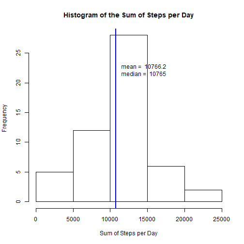
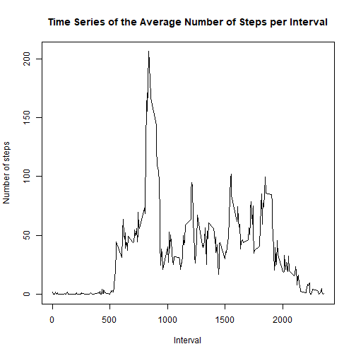
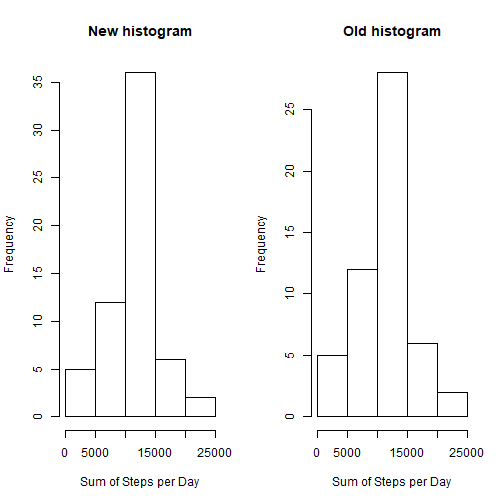
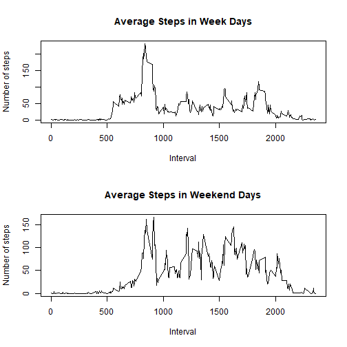

#Introduction
It is now possible to collect a large amount of data about personal movement using activity monitoring devices such as a Fitbit, Nike Fuelband, or Jawbone Up. These type of devices are part of the "quantified self" movement - a group of enthusiasts who take measurements about themselves regularly to improve their health, to find patterns in their behavior, or because they are tech geeks. But these data remain under-utilized both because the raw data are hard to obtain and there is a lack of statistical methods and software for processing and interpreting the data.

This device collects data at 5 minute intervals through out the day. The data consists of two months of data from an anonymous individual collected during the months of October and November, 2012 and include the number of steps taken in 5 minute intervals each day.

The data for this assignment can be downloaded from the course web site:

* Dataset: [Activity monitoring data](https://d396qusza40orc.cloudfront.net/repdata%2Fdata%2Factivity.zip) [52K]

The variables included in this dataset are:

* __steps:__ Number of steps taking in a 5-minute interval (missing values are coded as __NA__)
* __date:__ The date on which the measurement was taken in YYYY-MM-DD format
* __interval:__ Identifier for the 5-minute interval in which measurement was taken

The dataset is stored in a comma-separated-value (CSV) file and there are a total of 17,568 observations in this dataset.


#Load packages

Load xtable package.


```r
library(xtable)
```

#Load data

1. We first load the data to a data frame _activityDF_, remove the missing values (NAs), and reshape the data frame for further calculations, plots, and tables.


```r
#Load the data.
activityDF <- read.csv("activity.csv")

# Remove missing values from the data frame.
activityDFNoNA <- activityDF[!is.na(activityDF$steps), ]

# Calculate the sum of steps for each date and the mean and median of those sums.
stepsSumDF <- tapply(activityDFNoNA$steps, activityDFNoNA$date, sum) # Calculate the sum of steps for each date.
stepsMeanDF <- tapply(activityDFNoNA$steps, activityDFNoNA$date, mean) # Calculate the mean of steps for each date.
stepsMedianDF <- tapply(activityDFNoNA$steps, activityDFNoNA$date, median) # Calculate the median of steps for each date.

# Tabulate the sum, mean, and median of steps for each date.
stepsDF <- data.frame(stepsSumDF, stepsMeanDF, stepsMedianDF)
names(stepsDF) <- c("steps.sum", "steps.mean", "steps.median")

# Calculate the mean and median of steps for each date.
meanSteps <- mean(stepsDF$steps.sum, na.rm = T)
medianSteps <- median(stepsDF$steps.sum, na.rm = T)
```

#Conduct initial data exploration

2. This is a histogram of the total number of steps taken each day with lines denoting the mean and median number of steps (which happen to line up on top of each other in this plot).


```r
# Plot the histogram.
hist(
     stepsDF$steps.sum,
     main = "Histogram of the Sum of Steps per Day",
     xlab = "Sum of Steps per Day"
)

#Add mean and median lines and text.
abline(v = meanSteps, col = "blue", lwd = 2)
abline(v = medianSteps, col = "blue", lwd = 2)
text(11000, 22, paste("mean = ", round(meanSteps, 1), "\nmedian = ", medianSteps), pos = 4)
```



3. This is the mean and median number of steps taken each day.


```r
print(xtable(stepsDF), type = "html")
```

<!-- html table generated in R 3.4.0 by xtable 1.8-2 package -->
<!-- Sun Aug 13 19:09:03 2017 -->
<table border=1>
<tr> <th>  </th> <th> steps.sum </th> <th> steps.mean </th> <th> steps.median </th>  </tr>
  <tr> <td align="right"> 2012-10-01 </td> <td align="right">  </td> <td align="right">  </td> <td align="right">  </td> </tr>
  <tr> <td align="right"> 2012-10-02 </td> <td align="right"> 126 </td> <td align="right"> 0.44 </td> <td align="right"> 0.00 </td> </tr>
  <tr> <td align="right"> 2012-10-03 </td> <td align="right"> 11352 </td> <td align="right"> 39.42 </td> <td align="right"> 0.00 </td> </tr>
  <tr> <td align="right"> 2012-10-04 </td> <td align="right"> 12116 </td> <td align="right"> 42.07 </td> <td align="right"> 0.00 </td> </tr>
  <tr> <td align="right"> 2012-10-05 </td> <td align="right"> 13294 </td> <td align="right"> 46.16 </td> <td align="right"> 0.00 </td> </tr>
  <tr> <td align="right"> 2012-10-06 </td> <td align="right"> 15420 </td> <td align="right"> 53.54 </td> <td align="right"> 0.00 </td> </tr>
  <tr> <td align="right"> 2012-10-07 </td> <td align="right"> 11015 </td> <td align="right"> 38.25 </td> <td align="right"> 0.00 </td> </tr>
  <tr> <td align="right"> 2012-10-08 </td> <td align="right">  </td> <td align="right">  </td> <td align="right">  </td> </tr>
  <tr> <td align="right"> 2012-10-09 </td> <td align="right"> 12811 </td> <td align="right"> 44.48 </td> <td align="right"> 0.00 </td> </tr>
  <tr> <td align="right"> 2012-10-10 </td> <td align="right"> 9900 </td> <td align="right"> 34.38 </td> <td align="right"> 0.00 </td> </tr>
  <tr> <td align="right"> 2012-10-11 </td> <td align="right"> 10304 </td> <td align="right"> 35.78 </td> <td align="right"> 0.00 </td> </tr>
  <tr> <td align="right"> 2012-10-12 </td> <td align="right"> 17382 </td> <td align="right"> 60.35 </td> <td align="right"> 0.00 </td> </tr>
  <tr> <td align="right"> 2012-10-13 </td> <td align="right"> 12426 </td> <td align="right"> 43.15 </td> <td align="right"> 0.00 </td> </tr>
  <tr> <td align="right"> 2012-10-14 </td> <td align="right"> 15098 </td> <td align="right"> 52.42 </td> <td align="right"> 0.00 </td> </tr>
  <tr> <td align="right"> 2012-10-15 </td> <td align="right"> 10139 </td> <td align="right"> 35.20 </td> <td align="right"> 0.00 </td> </tr>
  <tr> <td align="right"> 2012-10-16 </td> <td align="right"> 15084 </td> <td align="right"> 52.38 </td> <td align="right"> 0.00 </td> </tr>
  <tr> <td align="right"> 2012-10-17 </td> <td align="right"> 13452 </td> <td align="right"> 46.71 </td> <td align="right"> 0.00 </td> </tr>
  <tr> <td align="right"> 2012-10-18 </td> <td align="right"> 10056 </td> <td align="right"> 34.92 </td> <td align="right"> 0.00 </td> </tr>
  <tr> <td align="right"> 2012-10-19 </td> <td align="right"> 11829 </td> <td align="right"> 41.07 </td> <td align="right"> 0.00 </td> </tr>
  <tr> <td align="right"> 2012-10-20 </td> <td align="right"> 10395 </td> <td align="right"> 36.09 </td> <td align="right"> 0.00 </td> </tr>
  <tr> <td align="right"> 2012-10-21 </td> <td align="right"> 8821 </td> <td align="right"> 30.63 </td> <td align="right"> 0.00 </td> </tr>
  <tr> <td align="right"> 2012-10-22 </td> <td align="right"> 13460 </td> <td align="right"> 46.74 </td> <td align="right"> 0.00 </td> </tr>
  <tr> <td align="right"> 2012-10-23 </td> <td align="right"> 8918 </td> <td align="right"> 30.97 </td> <td align="right"> 0.00 </td> </tr>
  <tr> <td align="right"> 2012-10-24 </td> <td align="right"> 8355 </td> <td align="right"> 29.01 </td> <td align="right"> 0.00 </td> </tr>
  <tr> <td align="right"> 2012-10-25 </td> <td align="right"> 2492 </td> <td align="right"> 8.65 </td> <td align="right"> 0.00 </td> </tr>
  <tr> <td align="right"> 2012-10-26 </td> <td align="right"> 6778 </td> <td align="right"> 23.53 </td> <td align="right"> 0.00 </td> </tr>
  <tr> <td align="right"> 2012-10-27 </td> <td align="right"> 10119 </td> <td align="right"> 35.14 </td> <td align="right"> 0.00 </td> </tr>
  <tr> <td align="right"> 2012-10-28 </td> <td align="right"> 11458 </td> <td align="right"> 39.78 </td> <td align="right"> 0.00 </td> </tr>
  <tr> <td align="right"> 2012-10-29 </td> <td align="right"> 5018 </td> <td align="right"> 17.42 </td> <td align="right"> 0.00 </td> </tr>
  <tr> <td align="right"> 2012-10-30 </td> <td align="right"> 9819 </td> <td align="right"> 34.09 </td> <td align="right"> 0.00 </td> </tr>
  <tr> <td align="right"> 2012-10-31 </td> <td align="right"> 15414 </td> <td align="right"> 53.52 </td> <td align="right"> 0.00 </td> </tr>
  <tr> <td align="right"> 2012-11-01 </td> <td align="right">  </td> <td align="right">  </td> <td align="right">  </td> </tr>
  <tr> <td align="right"> 2012-11-02 </td> <td align="right"> 10600 </td> <td align="right"> 36.81 </td> <td align="right"> 0.00 </td> </tr>
  <tr> <td align="right"> 2012-11-03 </td> <td align="right"> 10571 </td> <td align="right"> 36.70 </td> <td align="right"> 0.00 </td> </tr>
  <tr> <td align="right"> 2012-11-04 </td> <td align="right">  </td> <td align="right">  </td> <td align="right">  </td> </tr>
  <tr> <td align="right"> 2012-11-05 </td> <td align="right"> 10439 </td> <td align="right"> 36.25 </td> <td align="right"> 0.00 </td> </tr>
  <tr> <td align="right"> 2012-11-06 </td> <td align="right"> 8334 </td> <td align="right"> 28.94 </td> <td align="right"> 0.00 </td> </tr>
  <tr> <td align="right"> 2012-11-07 </td> <td align="right"> 12883 </td> <td align="right"> 44.73 </td> <td align="right"> 0.00 </td> </tr>
  <tr> <td align="right"> 2012-11-08 </td> <td align="right"> 3219 </td> <td align="right"> 11.18 </td> <td align="right"> 0.00 </td> </tr>
  <tr> <td align="right"> 2012-11-09 </td> <td align="right">  </td> <td align="right">  </td> <td align="right">  </td> </tr>
  <tr> <td align="right"> 2012-11-10 </td> <td align="right">  </td> <td align="right">  </td> <td align="right">  </td> </tr>
  <tr> <td align="right"> 2012-11-11 </td> <td align="right"> 12608 </td> <td align="right"> 43.78 </td> <td align="right"> 0.00 </td> </tr>
  <tr> <td align="right"> 2012-11-12 </td> <td align="right"> 10765 </td> <td align="right"> 37.38 </td> <td align="right"> 0.00 </td> </tr>
  <tr> <td align="right"> 2012-11-13 </td> <td align="right"> 7336 </td> <td align="right"> 25.47 </td> <td align="right"> 0.00 </td> </tr>
  <tr> <td align="right"> 2012-11-14 </td> <td align="right">  </td> <td align="right">  </td> <td align="right">  </td> </tr>
  <tr> <td align="right"> 2012-11-15 </td> <td align="right">  41 </td> <td align="right"> 0.14 </td> <td align="right"> 0.00 </td> </tr>
  <tr> <td align="right"> 2012-11-16 </td> <td align="right"> 5441 </td> <td align="right"> 18.89 </td> <td align="right"> 0.00 </td> </tr>
  <tr> <td align="right"> 2012-11-17 </td> <td align="right"> 14339 </td> <td align="right"> 49.79 </td> <td align="right"> 0.00 </td> </tr>
  <tr> <td align="right"> 2012-11-18 </td> <td align="right"> 15110 </td> <td align="right"> 52.47 </td> <td align="right"> 0.00 </td> </tr>
  <tr> <td align="right"> 2012-11-19 </td> <td align="right"> 8841 </td> <td align="right"> 30.70 </td> <td align="right"> 0.00 </td> </tr>
  <tr> <td align="right"> 2012-11-20 </td> <td align="right"> 4472 </td> <td align="right"> 15.53 </td> <td align="right"> 0.00 </td> </tr>
  <tr> <td align="right"> 2012-11-21 </td> <td align="right"> 12787 </td> <td align="right"> 44.40 </td> <td align="right"> 0.00 </td> </tr>
  <tr> <td align="right"> 2012-11-22 </td> <td align="right"> 20427 </td> <td align="right"> 70.93 </td> <td align="right"> 0.00 </td> </tr>
  <tr> <td align="right"> 2012-11-23 </td> <td align="right"> 21194 </td> <td align="right"> 73.59 </td> <td align="right"> 0.00 </td> </tr>
  <tr> <td align="right"> 2012-11-24 </td> <td align="right"> 14478 </td> <td align="right"> 50.27 </td> <td align="right"> 0.00 </td> </tr>
  <tr> <td align="right"> 2012-11-25 </td> <td align="right"> 11834 </td> <td align="right"> 41.09 </td> <td align="right"> 0.00 </td> </tr>
  <tr> <td align="right"> 2012-11-26 </td> <td align="right"> 11162 </td> <td align="right"> 38.76 </td> <td align="right"> 0.00 </td> </tr>
  <tr> <td align="right"> 2012-11-27 </td> <td align="right"> 13646 </td> <td align="right"> 47.38 </td> <td align="right"> 0.00 </td> </tr>
  <tr> <td align="right"> 2012-11-28 </td> <td align="right"> 10183 </td> <td align="right"> 35.36 </td> <td align="right"> 0.00 </td> </tr>
  <tr> <td align="right"> 2012-11-29 </td> <td align="right"> 7047 </td> <td align="right"> 24.47 </td> <td align="right"> 0.00 </td> </tr>
  <tr> <td align="right"> 2012-11-30 </td> <td align="right">  </td> <td align="right">  </td> <td align="right">  </td> </tr>
   </table>

4. This is a time series plot of the average number of steps taken.


```r
# Calculate the mean number of steps per interval.
meanInterval <- tapply(activityDFNoNA$steps, activityDFNoNA$interval, mean)

# Plot the time series of the average number of steps taken.
plot(
     x = names(meanInterval),
     y = meanInterval,
     type = "l",
     main = "Time Series of the Average Number of Steps per Interval",
     xlab = "Interval",
     ylab = "Number of steps"
     )
```



5. We find the 5-minute interval that, on average, contains the maximum number of steps.


```r
# Calculate the average number of steps for each interval and find the 5-minute interval that, on average, contains the maximum number of steps.
names(which.max(meanInterval))
```

```
## [1] "835"
```

#Impute Missing Values

6. Our imputing strategy is to replace missing values with the mean number of steps for the associated 5-minute interval.


```r
# Calculate the total number of missing values in the dataset (i.e. the total number of rows with NAs).
nrow(activityDF[is.na(activityDF$steps), ])
```

```
## [1] 2304
```

```r
# Create a new dataset that is equal to the original dataset but with the missing data filled in.
activityDFImputed <- data.frame(activityDF$date, activityDF$interval)
names(activityDFImputed) <- c("date", "interval")
for(i in 1:nrow(activityDF))
     {
     if(is.na(activityDF$steps[i]))
          activityDFImputed$steps[i] <- meanInterval[as.character(activityDF$interval[i])]
     else
          activityDFImputed$steps[i] <- activityDF$steps[i]
}

# Calculate the new sum of steps for each date and the mean and median of those sums.
stepsSumDF <- tapply(activityDFImputed$steps, activityDFImputed$date, sum) # Calculate the sum of steps for each date.
stepsMeanDF <- tapply(activityDFImputed$steps, activityDFImputed$date, mean) # Calculate the mean of steps for each date.
stepsMedianDF <- tapply(activityDFImputed$steps, activityDFImputed$date, median) # Calculate the median of steps for each date.

# Tabulate the sum, mean, and median of steps for each date.
stepsImputedDF <- data.frame(stepsSumDF, stepsMeanDF, stepsMedianDF)
names(stepsImputedDF) <- c("steps.sum", "steps.mean", "steps.median")
```

7. As we can see when we compare the new and old histograms of the total number of steps taken each day, the impact of imputing missing data increases the frequency of days with steps.


```r
# Plot the new and old histograms.
par(mfrow = c(1, 2))
hist(
     stepsSumDF,
     main = "New histogram",
     xlab = "Sum of Steps per Day"
)
hist(
     stepsDF$steps.sum,
     main = "Old histogram",
     xlab = "Sum of Steps per Day"
)
```



As we can see, the new mean and median number of steps taken each day have also increased (compared to the table in Step 3).


```r
print(xtable(stepsImputedDF), type = "html")
```

<!-- html table generated in R 3.4.0 by xtable 1.8-2 package -->
<!-- Sun Aug 13 19:09:05 2017 -->
<table border=1>
<tr> <th>  </th> <th> steps.sum </th> <th> steps.mean </th> <th> steps.median </th>  </tr>
  <tr> <td align="right"> 2012-10-01 </td> <td align="right"> 10766.19 </td> <td align="right"> 37.38 </td> <td align="right"> 34.11 </td> </tr>
  <tr> <td align="right"> 2012-10-02 </td> <td align="right"> 126.00 </td> <td align="right"> 0.44 </td> <td align="right"> 0.00 </td> </tr>
  <tr> <td align="right"> 2012-10-03 </td> <td align="right"> 11352.00 </td> <td align="right"> 39.42 </td> <td align="right"> 0.00 </td> </tr>
  <tr> <td align="right"> 2012-10-04 </td> <td align="right"> 12116.00 </td> <td align="right"> 42.07 </td> <td align="right"> 0.00 </td> </tr>
  <tr> <td align="right"> 2012-10-05 </td> <td align="right"> 13294.00 </td> <td align="right"> 46.16 </td> <td align="right"> 0.00 </td> </tr>
  <tr> <td align="right"> 2012-10-06 </td> <td align="right"> 15420.00 </td> <td align="right"> 53.54 </td> <td align="right"> 0.00 </td> </tr>
  <tr> <td align="right"> 2012-10-07 </td> <td align="right"> 11015.00 </td> <td align="right"> 38.25 </td> <td align="right"> 0.00 </td> </tr>
  <tr> <td align="right"> 2012-10-08 </td> <td align="right"> 10766.19 </td> <td align="right"> 37.38 </td> <td align="right"> 34.11 </td> </tr>
  <tr> <td align="right"> 2012-10-09 </td> <td align="right"> 12811.00 </td> <td align="right"> 44.48 </td> <td align="right"> 0.00 </td> </tr>
  <tr> <td align="right"> 2012-10-10 </td> <td align="right"> 9900.00 </td> <td align="right"> 34.38 </td> <td align="right"> 0.00 </td> </tr>
  <tr> <td align="right"> 2012-10-11 </td> <td align="right"> 10304.00 </td> <td align="right"> 35.78 </td> <td align="right"> 0.00 </td> </tr>
  <tr> <td align="right"> 2012-10-12 </td> <td align="right"> 17382.00 </td> <td align="right"> 60.35 </td> <td align="right"> 0.00 </td> </tr>
  <tr> <td align="right"> 2012-10-13 </td> <td align="right"> 12426.00 </td> <td align="right"> 43.15 </td> <td align="right"> 0.00 </td> </tr>
  <tr> <td align="right"> 2012-10-14 </td> <td align="right"> 15098.00 </td> <td align="right"> 52.42 </td> <td align="right"> 0.00 </td> </tr>
  <tr> <td align="right"> 2012-10-15 </td> <td align="right"> 10139.00 </td> <td align="right"> 35.20 </td> <td align="right"> 0.00 </td> </tr>
  <tr> <td align="right"> 2012-10-16 </td> <td align="right"> 15084.00 </td> <td align="right"> 52.38 </td> <td align="right"> 0.00 </td> </tr>
  <tr> <td align="right"> 2012-10-17 </td> <td align="right"> 13452.00 </td> <td align="right"> 46.71 </td> <td align="right"> 0.00 </td> </tr>
  <tr> <td align="right"> 2012-10-18 </td> <td align="right"> 10056.00 </td> <td align="right"> 34.92 </td> <td align="right"> 0.00 </td> </tr>
  <tr> <td align="right"> 2012-10-19 </td> <td align="right"> 11829.00 </td> <td align="right"> 41.07 </td> <td align="right"> 0.00 </td> </tr>
  <tr> <td align="right"> 2012-10-20 </td> <td align="right"> 10395.00 </td> <td align="right"> 36.09 </td> <td align="right"> 0.00 </td> </tr>
  <tr> <td align="right"> 2012-10-21 </td> <td align="right"> 8821.00 </td> <td align="right"> 30.63 </td> <td align="right"> 0.00 </td> </tr>
  <tr> <td align="right"> 2012-10-22 </td> <td align="right"> 13460.00 </td> <td align="right"> 46.74 </td> <td align="right"> 0.00 </td> </tr>
  <tr> <td align="right"> 2012-10-23 </td> <td align="right"> 8918.00 </td> <td align="right"> 30.97 </td> <td align="right"> 0.00 </td> </tr>
  <tr> <td align="right"> 2012-10-24 </td> <td align="right"> 8355.00 </td> <td align="right"> 29.01 </td> <td align="right"> 0.00 </td> </tr>
  <tr> <td align="right"> 2012-10-25 </td> <td align="right"> 2492.00 </td> <td align="right"> 8.65 </td> <td align="right"> 0.00 </td> </tr>
  <tr> <td align="right"> 2012-10-26 </td> <td align="right"> 6778.00 </td> <td align="right"> 23.53 </td> <td align="right"> 0.00 </td> </tr>
  <tr> <td align="right"> 2012-10-27 </td> <td align="right"> 10119.00 </td> <td align="right"> 35.14 </td> <td align="right"> 0.00 </td> </tr>
  <tr> <td align="right"> 2012-10-28 </td> <td align="right"> 11458.00 </td> <td align="right"> 39.78 </td> <td align="right"> 0.00 </td> </tr>
  <tr> <td align="right"> 2012-10-29 </td> <td align="right"> 5018.00 </td> <td align="right"> 17.42 </td> <td align="right"> 0.00 </td> </tr>
  <tr> <td align="right"> 2012-10-30 </td> <td align="right"> 9819.00 </td> <td align="right"> 34.09 </td> <td align="right"> 0.00 </td> </tr>
  <tr> <td align="right"> 2012-10-31 </td> <td align="right"> 15414.00 </td> <td align="right"> 53.52 </td> <td align="right"> 0.00 </td> </tr>
  <tr> <td align="right"> 2012-11-01 </td> <td align="right"> 10766.19 </td> <td align="right"> 37.38 </td> <td align="right"> 34.11 </td> </tr>
  <tr> <td align="right"> 2012-11-02 </td> <td align="right"> 10600.00 </td> <td align="right"> 36.81 </td> <td align="right"> 0.00 </td> </tr>
  <tr> <td align="right"> 2012-11-03 </td> <td align="right"> 10571.00 </td> <td align="right"> 36.70 </td> <td align="right"> 0.00 </td> </tr>
  <tr> <td align="right"> 2012-11-04 </td> <td align="right"> 10766.19 </td> <td align="right"> 37.38 </td> <td align="right"> 34.11 </td> </tr>
  <tr> <td align="right"> 2012-11-05 </td> <td align="right"> 10439.00 </td> <td align="right"> 36.25 </td> <td align="right"> 0.00 </td> </tr>
  <tr> <td align="right"> 2012-11-06 </td> <td align="right"> 8334.00 </td> <td align="right"> 28.94 </td> <td align="right"> 0.00 </td> </tr>
  <tr> <td align="right"> 2012-11-07 </td> <td align="right"> 12883.00 </td> <td align="right"> 44.73 </td> <td align="right"> 0.00 </td> </tr>
  <tr> <td align="right"> 2012-11-08 </td> <td align="right"> 3219.00 </td> <td align="right"> 11.18 </td> <td align="right"> 0.00 </td> </tr>
  <tr> <td align="right"> 2012-11-09 </td> <td align="right"> 10766.19 </td> <td align="right"> 37.38 </td> <td align="right"> 34.11 </td> </tr>
  <tr> <td align="right"> 2012-11-10 </td> <td align="right"> 10766.19 </td> <td align="right"> 37.38 </td> <td align="right"> 34.11 </td> </tr>
  <tr> <td align="right"> 2012-11-11 </td> <td align="right"> 12608.00 </td> <td align="right"> 43.78 </td> <td align="right"> 0.00 </td> </tr>
  <tr> <td align="right"> 2012-11-12 </td> <td align="right"> 10765.00 </td> <td align="right"> 37.38 </td> <td align="right"> 0.00 </td> </tr>
  <tr> <td align="right"> 2012-11-13 </td> <td align="right"> 7336.00 </td> <td align="right"> 25.47 </td> <td align="right"> 0.00 </td> </tr>
  <tr> <td align="right"> 2012-11-14 </td> <td align="right"> 10766.19 </td> <td align="right"> 37.38 </td> <td align="right"> 34.11 </td> </tr>
  <tr> <td align="right"> 2012-11-15 </td> <td align="right"> 41.00 </td> <td align="right"> 0.14 </td> <td align="right"> 0.00 </td> </tr>
  <tr> <td align="right"> 2012-11-16 </td> <td align="right"> 5441.00 </td> <td align="right"> 18.89 </td> <td align="right"> 0.00 </td> </tr>
  <tr> <td align="right"> 2012-11-17 </td> <td align="right"> 14339.00 </td> <td align="right"> 49.79 </td> <td align="right"> 0.00 </td> </tr>
  <tr> <td align="right"> 2012-11-18 </td> <td align="right"> 15110.00 </td> <td align="right"> 52.47 </td> <td align="right"> 0.00 </td> </tr>
  <tr> <td align="right"> 2012-11-19 </td> <td align="right"> 8841.00 </td> <td align="right"> 30.70 </td> <td align="right"> 0.00 </td> </tr>
  <tr> <td align="right"> 2012-11-20 </td> <td align="right"> 4472.00 </td> <td align="right"> 15.53 </td> <td align="right"> 0.00 </td> </tr>
  <tr> <td align="right"> 2012-11-21 </td> <td align="right"> 12787.00 </td> <td align="right"> 44.40 </td> <td align="right"> 0.00 </td> </tr>
  <tr> <td align="right"> 2012-11-22 </td> <td align="right"> 20427.00 </td> <td align="right"> 70.93 </td> <td align="right"> 0.00 </td> </tr>
  <tr> <td align="right"> 2012-11-23 </td> <td align="right"> 21194.00 </td> <td align="right"> 73.59 </td> <td align="right"> 0.00 </td> </tr>
  <tr> <td align="right"> 2012-11-24 </td> <td align="right"> 14478.00 </td> <td align="right"> 50.27 </td> <td align="right"> 0.00 </td> </tr>
  <tr> <td align="right"> 2012-11-25 </td> <td align="right"> 11834.00 </td> <td align="right"> 41.09 </td> <td align="right"> 0.00 </td> </tr>
  <tr> <td align="right"> 2012-11-26 </td> <td align="right"> 11162.00 </td> <td align="right"> 38.76 </td> <td align="right"> 0.00 </td> </tr>
  <tr> <td align="right"> 2012-11-27 </td> <td align="right"> 13646.00 </td> <td align="right"> 47.38 </td> <td align="right"> 0.00 </td> </tr>
  <tr> <td align="right"> 2012-11-28 </td> <td align="right"> 10183.00 </td> <td align="right"> 35.36 </td> <td align="right"> 0.00 </td> </tr>
  <tr> <td align="right"> 2012-11-29 </td> <td align="right"> 7047.00 </td> <td align="right"> 24.47 </td> <td align="right"> 0.00 </td> </tr>
  <tr> <td align="right"> 2012-11-30 </td> <td align="right"> 10766.19 </td> <td align="right"> 37.38 </td> <td align="right"> 34.11 </td> </tr>
   </table>

#Look into differences between in activity patterns between week days and weekend days

8. Finally, through panel plots comparing the average number of steps taken per 5-minute interval across weekdays and weekend days, we see that people generally take more steps in the weekends and those steps are more distributed throughout the day.


```r
# Create a new variable in the dataset with two levels ??? ???Week day??? and ???Weekend day??? indicating whether a given date is a weekday or weekend day.
for(i in 1:nrow(activityDFImputed))
     {
     if(weekdays(as.Date(activityDFImputed$date[i])) %in% c("Saturday", "Sunday"))
          activityDFImputed$weekday[i] <- "Weekend day"
     else
          activityDFImputed$weekday[i] <- "Week day"
}

# Calculate the mean number of steps per interval for the imputed data set for week days.
meanIntervalWeekday <- tapply(
     activityDFImputed[activityDFImputed$weekday == "Week day", ]$steps,
     activityDFImputed[activityDFImputed$weekday == "Week day", ]$interval,
     mean
     )

# Calculate the mean number of steps per interval for the imputed data set for weekend days.
meanIntervalWeekendDay <- tapply(
     activityDFImputed[activityDFImputed$weekday == "Weekend day", ]$steps,
     activityDFImputed[activityDFImputed$weekday == "Weekend day", ]$interval,
     mean
     )

# Plot the time series of the average number of steps taken in week days and weekend days in a panel.
par(mfrow = c(2, 1))
plot(
     x = names(meanIntervalWeekday),
     y = meanIntervalWeekday,
     type = "l",
     main = "Average Steps in Week Days",
     xlab = "Interval",
     ylab = "Number of steps"
     )
plot(
     x = names(meanIntervalWeekendDay),
     y = meanIntervalWeekendDay,
     type = "l",
     main = "Average Steps in Weekend Days",
     xlab = "Interval",
     ylab = "Number of steps"
     )
```



#Thank you!

Thanks for reading this! I hope this has been useful for you!
